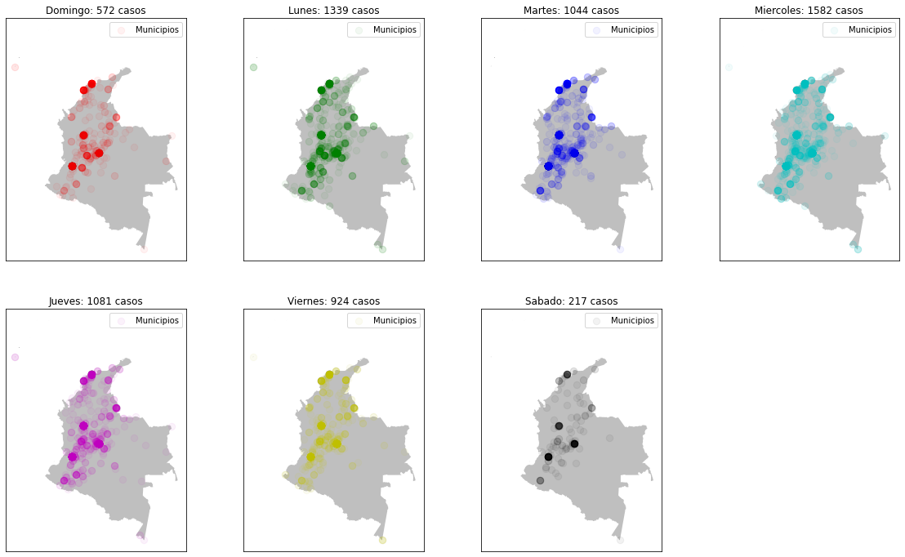

# Delitos Sexuales en Colombia

Los casos de crímenes sexuales van en aumento, y proporcionalmente la inseguridad de algunos sitio también han incrementado, pero y si hubiera una forma de predecir la hora y el lugar donde un posible delito sexual, con ello se podría reforzar la seguridad en dicho lugar y con ello el índice de delitos sexuales disminuye notablemente y así mejorando la calidad de vida de los ciudadanos.
## Objetivo general:
Realizar una predicción del dia de la semana, hora y municipio en que ocurre un posible delito sexual, por medio de un análisis de datos proporcionados por la policía nacional de Colombia

## Video

